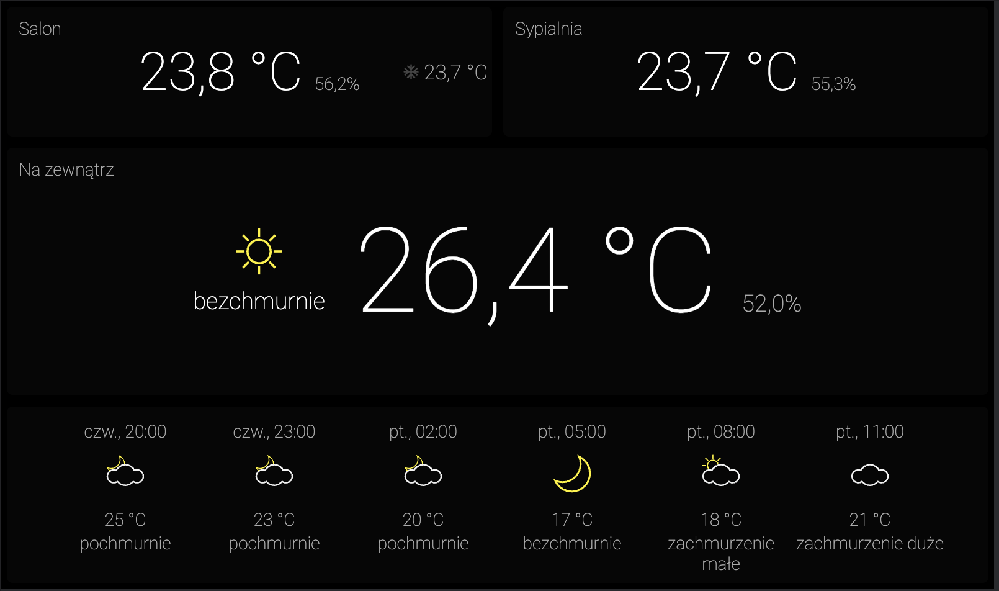

# Home Climate Information Display

Subscribed to status & measure updates from [Home Climate Controller](https://github.com/ptkoz/infodisplay-controller) (
through websockets).

## Features

* Shows current temperature in all rooms and current outside temperature
  from [Remote Sensors](https://github.com/pamelus/air-conditioning-sensor)
* Shows current AC status and configured desired temperature
* Allows adjusting desired room temperature
* Shows current weather and weather forecast in 3h intervals  

